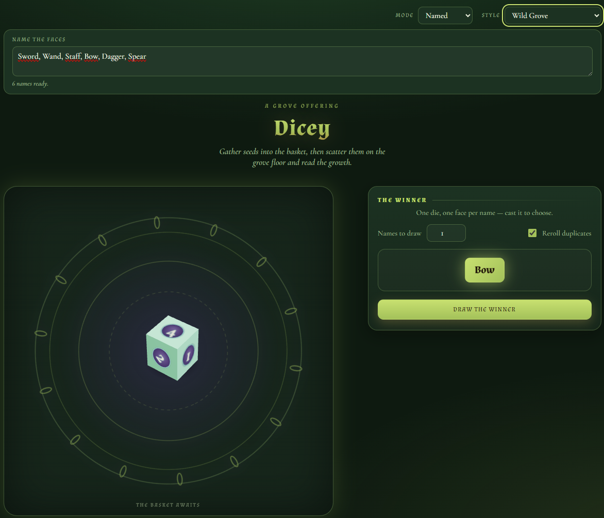
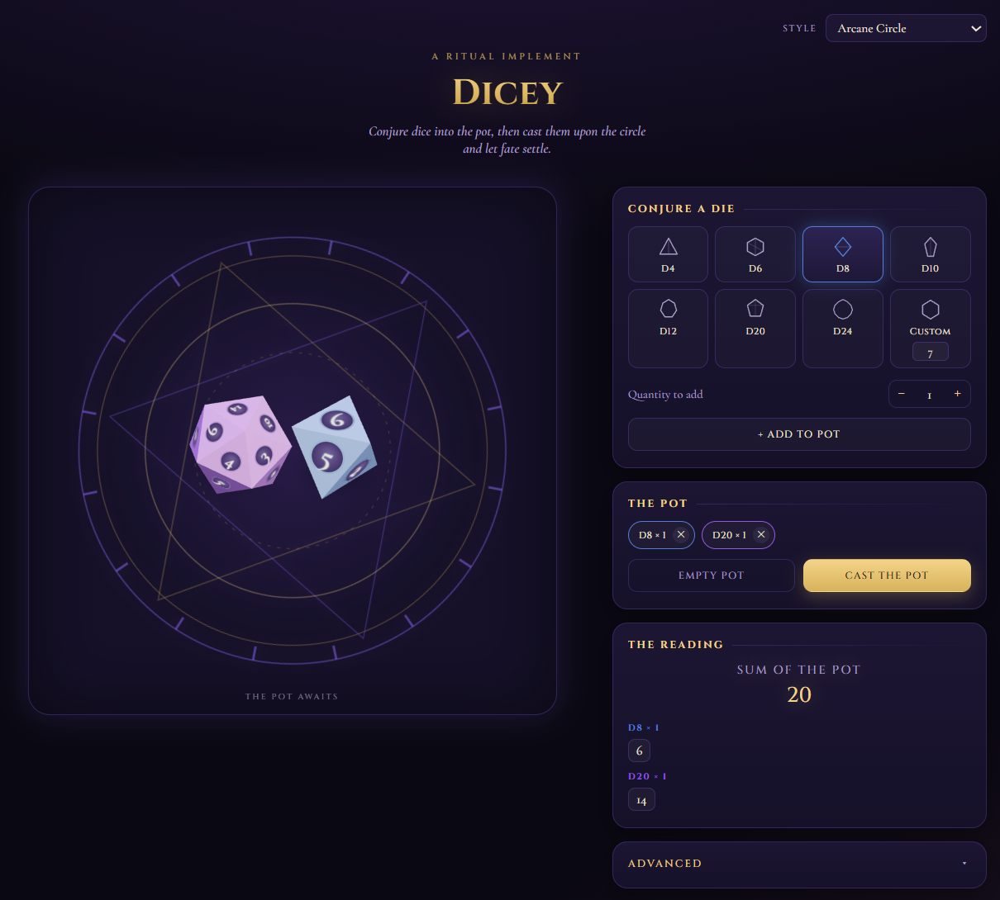
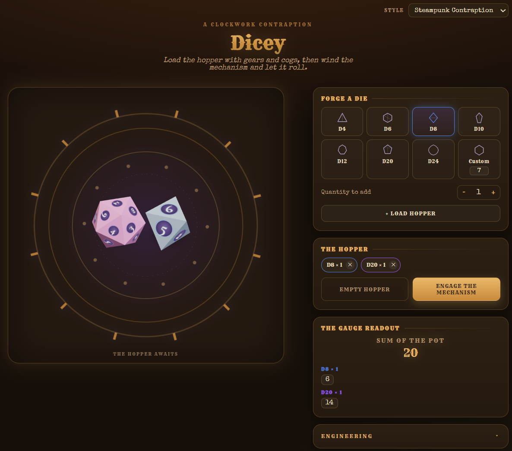
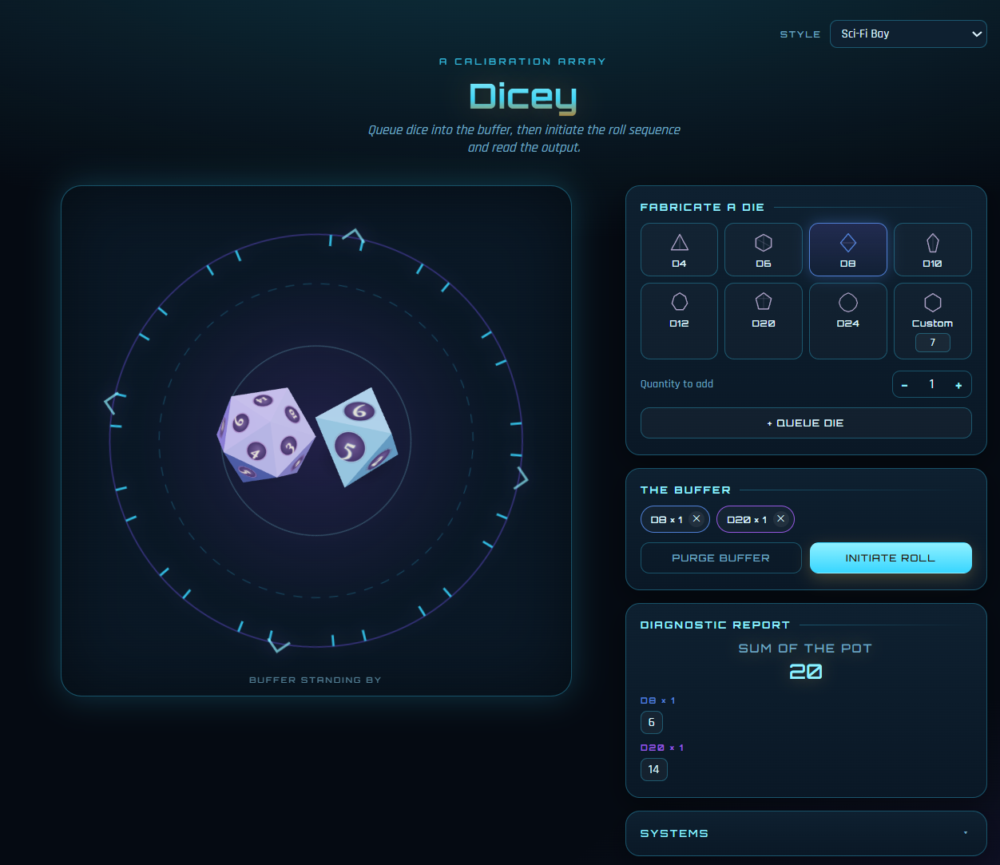
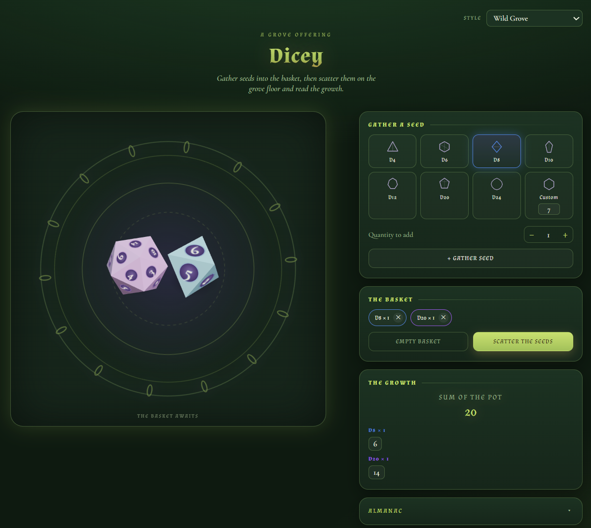

# 🎲 Dicey

**[▶ Try it live](https://zoutbot-cpu.github.io/Dicey/)**

A single-file, fully 3D dice roller for tabletop campaigns. No build step, no npm install, no backend — open one HTML file and start rolling.

Built for D&D and other tabletop games that want more than a flat number: real polyhedral geometry, a pot system for queuing up a handful of dice at once, a name-drawing mode for picking winners instead of numbers, and four full visual themes so the roller can match your campaign's vibe.

---

## Features

**Real 3D dice, not sprites**
Every die is an actual polyhedron rendered with three.js — not a 2D icon or a pre-baked animation.

- **D4, D6, D8, D12, D20** — the standard Platonic solids
- **D10** — a proper pentagonal trapezohedron (10 congruent kite faces), not a stretched cone
- **D24** — a true deltoidal icositetrahedron, derived as the polar dual of a rhombicuboctahedron (the same construction real 24-sided dice use)
- **Custom "X-sided die"** — pick any number of sides from 4–100:
  - Even side counts → a generalized trapezohedron with congruent kite faces
  - Odd side counts → a prism ("log die") with congruent rectangular sides and two small end caps that are excluded from the roll — because no convex solid can have an odd number of mutually congruent faces, this is how real fair odd-sided dice are actually made

**The Pot**
Queue up any mix of dice — 3d6 and a d20, or seventeen d4s, whatever the moment calls for — then cast them all at once. Standard dice tumble and drop with a bounce; custom dice roll in from the side like an actual rolling object.

**Named mode**
Flip from Numbered to Named mode and the pot is replaced by **The Winner** — type in a list of names (party members, suspects, loot table entries, whatever) and Dicey automatically builds a fair die with exactly that many faces, one per name. Draw a single winner or several at once:

- **Names to draw** — pull more than one winner in a single cast
- **Reroll duplicates** — guarantees every draw is a distinct name (a proper shuffle, not roll-and-hope), or turn it off to allow repeats
- Winners pop in with a gold flash reveal, one after another



**Themes**
A single dropdown reskins the entire page — colors, fonts, the decorative ring artwork, scene lighting, die material finish, and even the UI copy:

| Arcane Circle | Steampunk Contraption |
|---|---|
|  |  |

| Sci-Fi Bay | Wild Grove |
|---|---|
|  |  |

**Advanced panel** *(Numbered mode)*
- **Score multiplier** — scale the total (crit damage, etc.)
- **Flat modifier** — add/subtract a bonus after the multiplier (ability modifiers, proficiency bonus)
- **Built-in calculator** — work out a number and send it straight into the modifier field

## Usage

There's nothing to install. Download `index.html` and open it in any modern browser, or host it on any static file server (GitHub Pages, Netlify, a folder on a USB stick — anything that serves HTML works).

```bash
open index.html
# or just double-click it
```

## How it works

- **Geometry** is built at runtime from first principles using `three.js` primitives (Tetrahedron/Box/Octahedron/Dodecahedron/Icosahedron for the Platonic dice) plus hand-derived constructions for the D10/D24/custom dice, verified for planarity and correct triangle winding.
- **Face numbering** uses a generic opposite-face-pairing algorithm (labels sum to N+1 across opposite faces, matching real dice conventions) — it works for any face count the geometry produces, including odd counts.
- **Rolling** picks a target face up front, computes the quaternion that puts it "up," and animates toward it — so the die always lands on a value that was actually decided by the dice pool, not the animation.
- **Named mode** reuses the same fair-die geometry (trapezohedron for even name counts, log-die prism for odd ones) and maps each face 1:1 to a name, so the "randomness" is coming from an actual physically fair die, not a separate RNG call.
- **No frameworks.** Vanilla JS, CSS custom properties for theming, and three.js (r128) loaded from a CDN. Everything lives in one `.html` file.

## License

GNU GENERAL PUBLIC LICENSE — do whatever you want with it.
